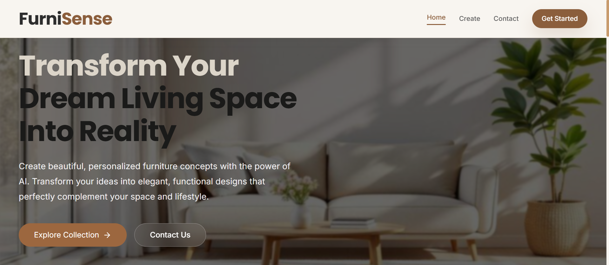
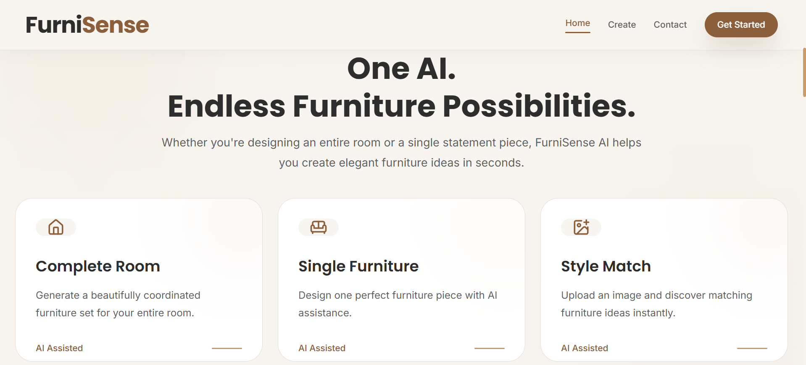
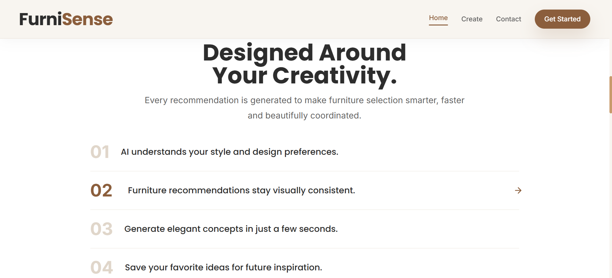
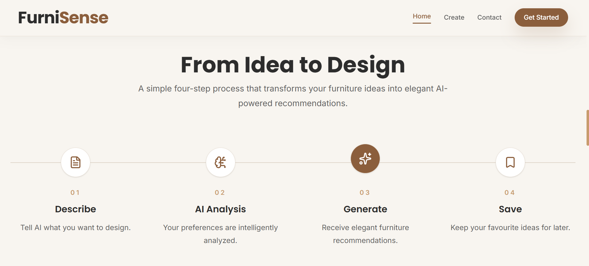
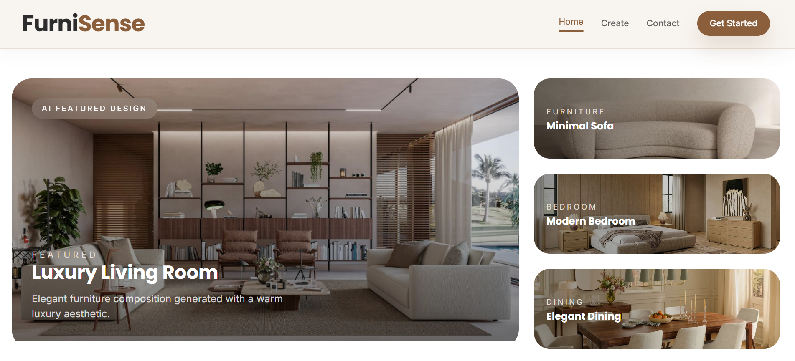
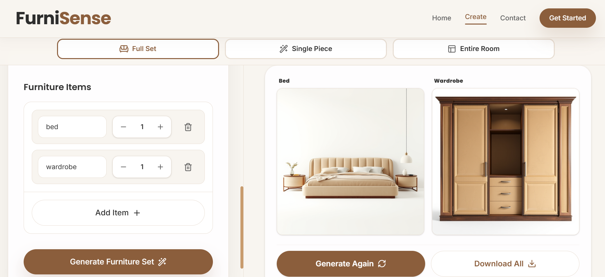
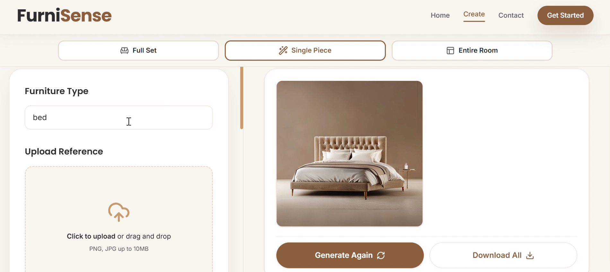
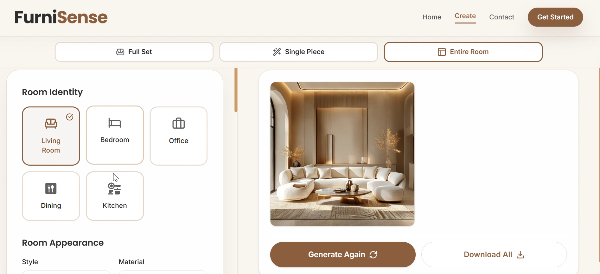

# FurniSense AI 🛋️✨

### AI-Powered Furniture Visualization & Interior Design Studio

FurniSense AI is a modern AI-powered furniture visualization platform that transforms natural-language design ideas into realistic furniture concepts and complete interior scenes.

Users can describe the furniture, materials, colors, styles, or room they have in mind and generate AI-powered visualizations that bring those ideas to life.

The project combines a polished, responsive React interface with secure server-side AI integration and production-ready deployment.

---

## 🌐 Live Demo

### 🚀 Try FurniSense AI

**Live Application:**  
https://furni-sense-ai.vercel.app/

---

## 📸 Product Preview

### Hero Section



### Features



### How It Works



### AI Workflow



### Generated Design Samples



---

# ✨ What is FurniSense AI?

Furniture visualization often requires imagining how a particular design, material, color, or piece of furniture will look in a real environment.

FurniSense AI simplifies this process by allowing users to describe their ideas in natural language and generate visual concepts using AI.

Instead of manually searching through catalogs or trying to visualize a piece of furniture from a text description, users can interact with the application and generate realistic visual results based on their requirements.

The platform supports both **individual furniture generation** and **complete room visualization**, making it useful for exploring furniture concepts, interior styles, and design ideas.

---

# 🎯 Core Features

## 🪑 AI Furniture Generation

Generate realistic furniture concepts from natural-language descriptions.

Users can specify details such as:

- Furniture type
- Design style
- Color
- Material
- Visual characteristics
- Additional design requirements

The application converts these requirements into optimized image-generation prompts.

---

## 🧩 Multiple Furniture Pieces

FurniSense AI allows users to request multiple furniture pieces in a single design session.

Each selected item can be processed individually and receive its own AI-generated visualization.



---

## 🪑 Single Furniture Visualization

Users can focus on a specific furniture item and generate a dedicated product-style visualization.

This is useful for exploring individual concepts such as:

- Sofas
- Chairs
- Tables
- Beds
- Cabinets
- Shelves
- Lamps
- Other furniture concepts



---

## 🏠 Entire Room Visualization

One of the core features of FurniSense AI is complete room visualization.

Users can describe a room and its desired furniture arrangement, and the application generates a realistic interior scene with:

- Furniture placement
- Lighting
- Materials
- Interior composition
- Spatial arrangement
- Realistic shadows and reflections



---

## 🎨 Natural-Language Design Input

The application is designed around natural-language interaction.

Users don't need to understand technical image-generation parameters.

They can simply describe what they want, for example:

> Modern beige luxury sofa with soft fabric, wooden legs and a minimal contemporary design.

FurniSense AI handles the prompt preparation behind the scenes.

---

## 📸 Photorealistic AI Results

Generation prompts are optimized for realistic furniture and interior visualization.

The system emphasizes:

- Photorealistic rendering
- Realistic materials
- Professional lighting
- Detailed textures
- Natural shadows
- Interior design composition
- Premium visual presentation

---

# 🧠 How FurniSense AI Works

The application follows a simple user-to-AI workflow:

```text
User
 │
 ▼
Design Requirements
 │
 ▼
Furniture / Room Configuration
 │
 ▼
Prompt Preparation
 │
 ▼
FurniSense Generation Service
 │
 ▼
Secure Server-side API Route
 │
 ▼
Hugging Face Inference API
 │
 ▼
AI Image Generation
 │
 ▼
Generated Visualization
 │
 ▼
Displayed in FurniSense AI